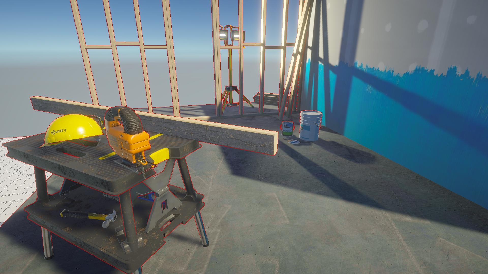
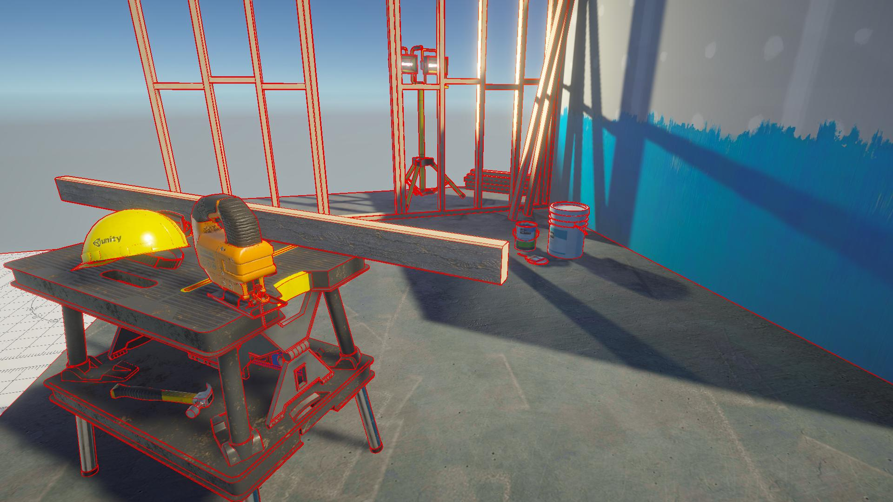
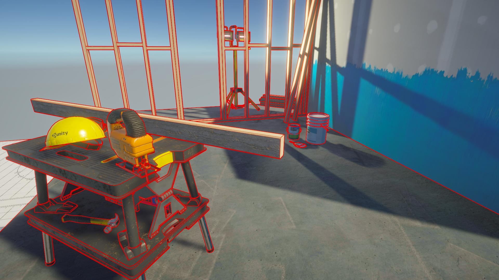

DepthOnly:

NormalsOnly:

Depth+Normals:

Depth+Normals+MeshID:

Depth+Normals+MeshID with [TAA](https://assetstore.unity.com/packages/vfx/shaders/fullscreen-camera-effects/urp-taa-193976):

Reference:

https://assetstore.unity.com/packages/vfx/shaders/fullscreen-camera-effects/urp-taa-193976

https://github.com/Hazukiaoi/UnityMaltLineArt

https://roystan.net/articles/outline-shader.html

https://alexanderameye.github.io/notes/edge-detection-outlines/#

https://zhuanlan.zhihu.com/p/232450616